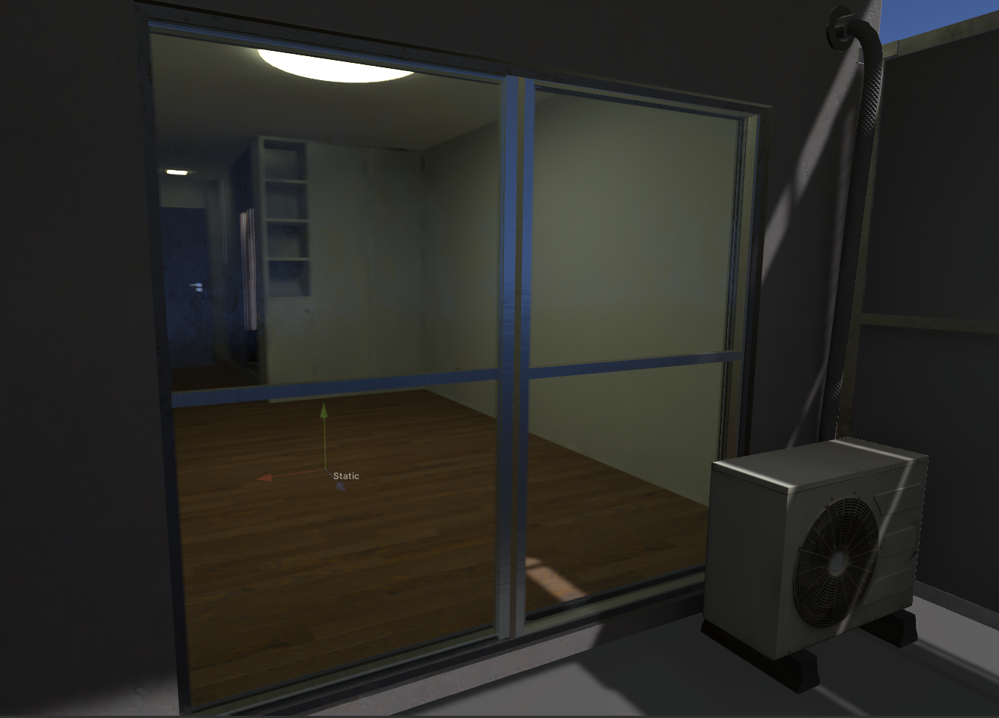

# Realistic Volumetric Glass Shader (Unity BRP)

## Introduction

A physically-based glass shader designed for the **Unity Built-in Render Pipeline (BRP)** and **VRChat** environments.

This shader applies the **Beer-Lambert Law** to simulate physical light absorption based on the thickness of the glass. This achieves a realistic glass material where thin areas appear transparent, while thicker areas appear denser and darker.

The shader has been verified to work in **Unity 2022.3.22f1, 2022.3.22f2** and **VRChat**.

## Key Features

- Instead of simple texture compositing, it calculates the **distance (thickness)** light travels through the glass to reproduce exponential color absorption based on depth.
- It calculates the refractive index differences based on light wavelength to express prism-like edge details (Chromatic Aberration).

## Gallery

  <table>
    <tr>
      <td align="center">
        <video src="https://github.com/user-attachments/assets/d4fabdca-d540-4030-88b0-dbd326be6298" width="100%" controls autoplay loop muted></video>
      </td>
    </tr>
    <tr>
      <td align="center">
        <video src="https://github.com/user-attachments/assets/dfd13087-c7e7-404f-8969-8435d52d4d2d" width="100%" controls autoplay loop muted></video>
      </td>
    </tr>
    <tr>
      <td align="center">
        
      </td>
    </tr>
  </table>

## Compatibility

This shader has been tested and verified in the following environments:

* **Unity Version:**
  * 2022.3.22f1 (Verified)
  * 2022.3.22f2 (Verified)

* **Platform:**
  * VRChat
 
---

